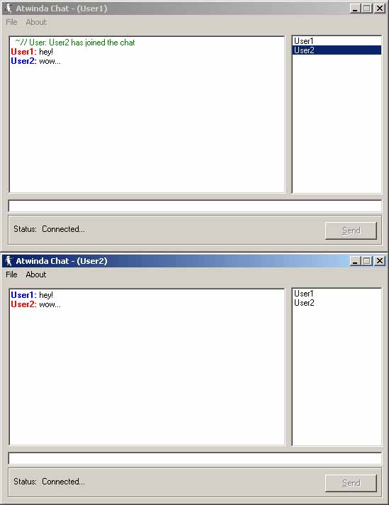



## Atwinda Network Chat v1 beta 2 \*with server source

### Description

Atwinda Network Chat is a way good Network Chat.

The Server is a very stable iformation directing hard @$$. This time I have included the source for the Server, which I kocked for not uploading last time. The server supports: getIP, KickUsers, and Users Indexs(what winsock there on).

The client side has been updated with some new features such as the sound options, and save username and sever IP.

In my normal style, I am only gona ask once for a vote from all of you!

Please VOTE!!!!!!!!!! this is really a great code!

it now includes the Server source!!!
 
### More Info
 

             |
---                |---
**Submitted On**   |2001-01-09 17:02:46
**By**             |[atwinda](https://github.com/Planet-Source-Code/PSCIndex/blob/master/ByAuthor/atwinda.md)
**Level**          |Advanced
**User Rating**    |4.6 (79 globes from 17 users)
**Compatibility**  |VB 5\.0, VB 6\.0
**Category**       |[Internet/ HTML](https://github.com/Planet-Source-Code/PSCIndex/blob/master/ByCategory/internet-html__1-34.md)
**World**          |[Visual Basic](https://github.com/Planet-Source-Code/PSCIndex/blob/master/ByWorld/visual-basic.md)
**Archive File**   |[CODE\_UPLOAD136751112001\.zip](https://github.com/Planet-Source-Code/atwinda-atwinda-network-chat-v1-beta-2-with-server-source__1-14346/archive/master.zip)

